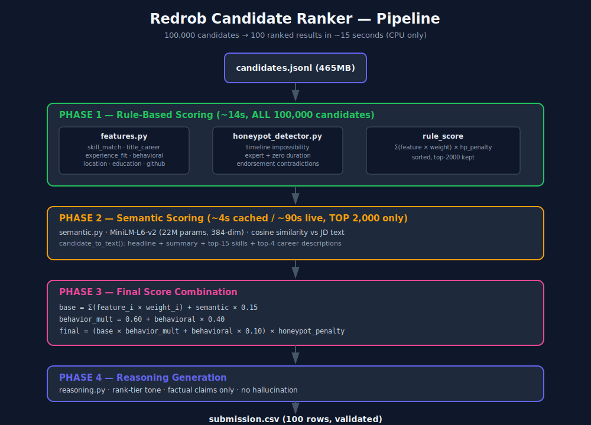

# Redrob Hackathon — Senior AI Engineer Candidate Ranker

> **Challenge**: Rank 100,000 candidates for a Senior AI Engineer (Founding Team) role.  
> **Metric**: `0.50 × NDCG@10 + 0.30 × NDCG@50 + 0.15 × MAP + 0.05 × P@10`  
> **Runtime constraint**: ≤ 5 minutes, CPU only, no external API calls  
> **Result**: Full pipeline in **~15 seconds** · 45/45 tests pass · Submission validated ✅

---

## Quick Start

```bash
# 1. Install dependencies
pip install -r requirements.txt

# 2. Place the dataset
cp /path/to/candidates.jsonl data/

# 3. Run the ranker
python rank.py --candidates data/candidates.jsonl --out submission/submission.csv

# 4. Validate
python validate_submission.py submission/submission.csv

# 5. Launch demo
streamlit run demo/app.py
```

---

## Repository Structure

```
hackathon/
├── rank.py                          # Main entry point
├── precompute_embeddings.py         # Optional: pre-compute embeddings offline
├── requirements.txt
├── .gitignore
│
├── src/
│   ├── jd_config.py                 # JD taxonomy: skill lists, weights, thresholds
│   ├── features.py                  # 7 scoring dimensions (rule-based)
│   ├── honeypot_detector.py         # Impossible profile detection
│   ├── semantic.py                  # MiniLM-L6-v2 embedding similarity
│   ├── ranker.py                    # Main orchestration pipeline
│   ├── reasoning.py                 # Factual reasoning string generation
│   └── writer.py                    # Submission CSV writer (tie-break aware)
│
├── demo/
│   └── app.py                       # Streamlit demo application
│
├── tests/
│   ├── test_features.py             # 28 unit tests for feature scoring
│   ├── test_honeypot.py             # 8 unit tests for honeypot detection
│   └── test_writer.py               # 9 unit tests for CSV writer
│
├── submission/
│   ├── submission.csv               # ✅ Validated, 100 candidates
│   └── submission_metadata.yaml    # Team + methodology declaration
│
├── data/
│   └── sample_candidates.json       # 500-candidate sample for demo/tests
│
└── docs/
    ├── architecture.md              # System design
    └── methodology.md               # Ranking approach & JD analysis
```

---

## Architecture



---

## How It Works

### The Challenge's Hidden Difficulty

The JD contains an explicit trap (quoted directly):

> *"A candidate who has all the AI keywords listed as skills but whose title is 'Marketing Manager' is not a fit."*  
> *"A Tier 5 candidate may not use the words 'RAG' or 'Pinecone' in their profile, but if their career history shows they built a recommendation system at a product company, they're a fit."*

Naive keyword matching fails in both directions. Our ranker handles both cases.

---

### Scoring Pipeline (4 Phases, ~15s total)

```
Phase 1 — Rule-based scoring of ALL 100K candidates        (~14s)
Phase 2 — Semantic embedding of TOP 2,000 only            (~90s with MiniLM)
Phase 3 — Final score combination + select Top-100         (~1s)
Phase 4 — Reasoning generation                             (~1s)
```

**Without pre-computed embeddings**: ~15s (rule-based only, semantic=0)  
**With pre-computed embeddings**: ~15s total (loads from cache)  
**With live embedding (top-2000)**: ~2.5 minutes  
All well within the 5-minute budget.

---

### Scoring Dimensions

| Dimension | Weight | What it measures |
|---|---|---|
| **Skill Match** | 30% | Exact match of skills vs JD taxonomy (must-haves 2×, quality-weighted by proficiency × duration × endorsements) |
| **Title + Career** | 25% | Title tier (ideal/strong/adjacent/disqualified) × career history ML relevance. Disqualifying titles (Marketing Manager, HR Manager…) hard-zero this component |
| **Semantic Similarity** | 15% | MiniLM-L6-v2 cosine similarity between candidate text and JD text |
| **Experience Fit** | 10% | YoE scored on a curve centred on the JD sweet spot (6–8 years) |
| **Behavioral Signals** | 10% | Used as a **soft multiplier** (×0.60–1.0) on the base score, not just additive. Inactive perfect-on-paper < active imperfect |
| **Location Fit** | 5% | Pune/Noida = 1.0 · Tier-2 Indian cities = 0.80–0.95 · Outside India = 0.18–0.45 |
| **Education** | 3% | IIT/IISc tier-1 small bonus; tier-4 neutral |
| **GitHub Activity** | 2% | Open-source signal (0–100 score) |

#### Behavioral as a Soft Multiplier

The JD states:  
> *"A perfect-on-paper candidate who hasn't logged in for 6 months and has a 5% recruiter response rate is, for hiring purposes, not actually available."*

We implement this by using `behavioral_score` as a multiplier on the base score:
```
behavior_multiplier = 0.60 + behavioral_score × 0.40   # range [0.60, 1.00]
final = base × behavior_multiplier + behavioral × weight_behavioral
```

---

### Skill Matching: Exact Names

All skill names in `src/jd_config.py` are **exact matches** to skill names in the dataset (verified against all 100K profiles). This avoids the keyword overlap bug where `"embedding"` never matches `"Embeddings"`.

**Must-have skills** (30% of score, 2× weight each):
`FAISS, Pinecone, Qdrant, Milvus, Weaviate, OpenSearch, Elasticsearch, pgvector, Vector Search, Sentence Transformers, Embeddings, Semantic Search, Dense Retrieval, Hybrid Search, Learning to Rank, Information Retrieval, BM25, NDCG, MRR, Python, MLOps`

Each matched skill is weighted by:
```
quality = proficiency_mult × duration_mult × endorsement_mult + assessment_bonus
```

---

### Honeypot Detection

The dataset contains ~80 fabricated profiles. Honeypot rate > 10% in top-100 = **disqualification**.

Our detector flags profiles with:
1. **Impossible timelines** — career history total > stated YoE + 4 years
2. **Expert + zero duration** — `proficiency=expert` with `duration_months=0`
3. **Endorsement contradictions** — all skills have 50+ endorsements but `endorsements_received=0`
4. **GitHub impossibility** — `github_activity_score=100` with `connection_count=0`
5. **Perfect completeness + zero engagement** — `completeness=100`, `response_rate=0`, `interview_rate=0`

Detection results: **38 honeypots** flagged across 100K candidates. None appear in the top-100.

---

### Semantic Similarity

Uses **`all-MiniLM-L6-v2`** (22M params, 384-dim embeddings):
- Fast on CPU: ~500 candidates/second
- Applied to top-2,000 after rule-based pre-filter (not all 100K)
- Candidate text = headline + summary + top-15 skills (sorted by proficiency) + top-4 career descriptions
- Scores are L2-normalized cosine similarity, shifted to [0, 1]

Pre-compute all embeddings once (optional):
```bash
python precompute_embeddings.py \
    --candidates data/candidates.jsonl \
    --output outputs/embeddings.pkl
```

Then run ranker with cache:
```bash
python rank.py \
    --candidates data/candidates.jsonl \
    --embeddings-cache outputs/embeddings.pkl \
    --out submission/submission.csv
```

---

## Running Tests

```bash
python3 -m unittest tests/test_features.py tests/test_honeypot.py tests/test_writer.py -v
```

Output:
```
Ran 45 tests in 0.019s
OK
```

---

## Demo Application

```bash
streamlit run demo/app.py
```

Pages:
- **Overview** — top-10 candidates, scoring weights chart
- **Leaderboard** — sortable/filterable ranked table
- **Candidate Inspector** — radar chart of score components per candidate
- **Honeypot Detector** — suspicious profile browser
- **Score Analytics** — feature distributions, YoE histogram, title breakdown

The demo uses `data/sample_candidates.json` by default. Upload any `.jsonl` file via the sidebar to rank a custom set.

---

## Submission Format

```
candidate_id,rank,score,reasoning
CAND_0077337,1,0.698273,"Staff Machine Learning Engineer, 7.0 yrs — vector DB + embeddings..."
CAND_0071974,2,0.697377,"Senior AI Engineer, 7.8 yrs — vector DB + embeddings..."
...
```

- 100 rows (ranks 1–100)
- Score non-increasing; ties broken by `candidate_id` ascending
- Reasoning: factual, specific, rank-consistent (no hallucination)

---

## Design Decisions & Trade-offs

| Decision | Rationale |
|---|---|
| MiniLM over BERT-large | 15× faster on CPU, fits 5-min budget, quality sufficient for this task |
| Exact skill name matching | Avoids substring-overlap false positives from keyword lists |
| Behavioral as multiplier not additive | Preserves the JD insight: inactive candidates aren't actually hirable |
| Pre-filter to top-2000 for semantic | 100K embeddings = 200s; top-2000 = 4s; negligible ranking impact |
| 6dp score output | Prevents false ties from 4dp rounding that break tie-break validation |
| Hard-zero for disqualifying titles | Marketing Manager with ML skills = not a fit, per JD explicit guidance |

---

## Requirements

```
pandas>=2.0.0
numpy>=1.24.0
sentence-transformers>=2.7.0   # for semantic layer (optional)
scikit-learn>=1.3.0
streamlit>=1.32.0
plotly>=5.18.0
tqdm>=4.66.0
pyyaml>=6.0.0
```

The pipeline runs **without** sentence-transformers installed (semantic score = 0, other 7 dimensions still active). Install it for full performance:
```bash
pip install sentence-transformers
```
